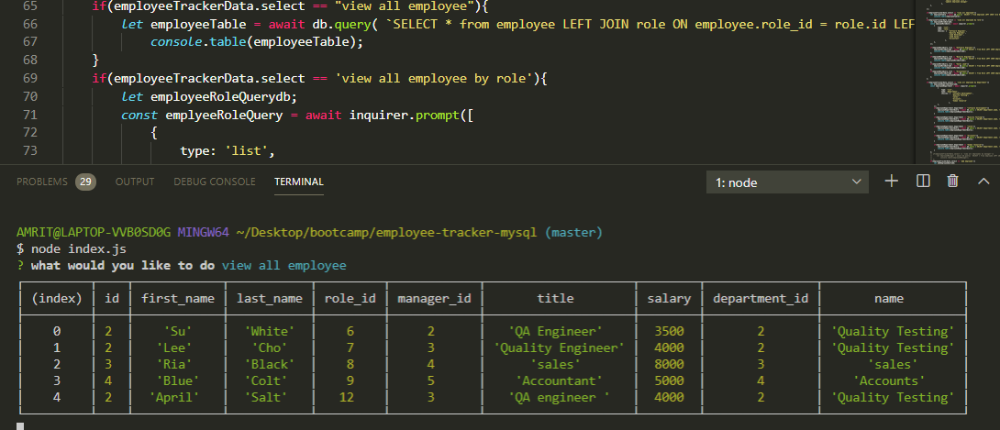
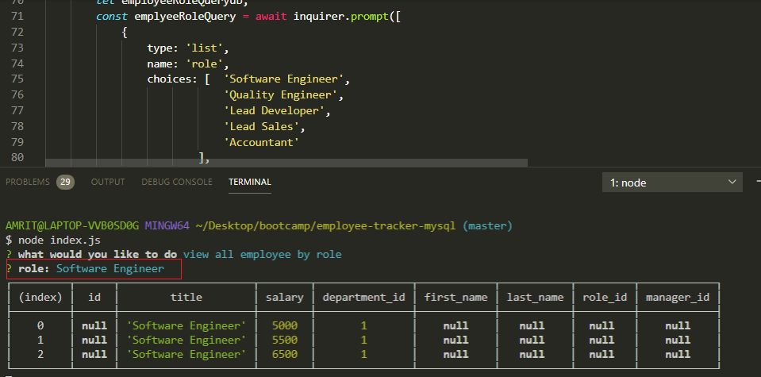
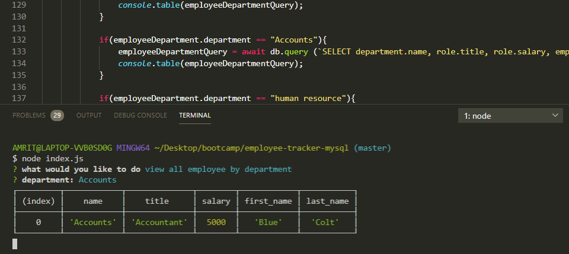
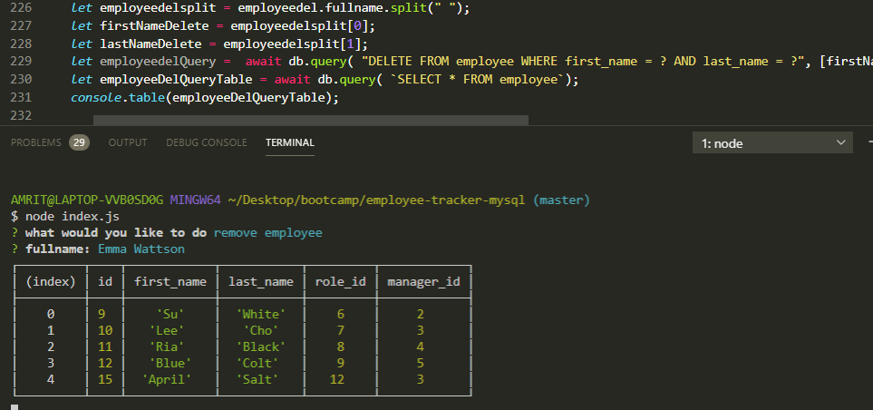

# employee-tracker-mysql
Built a solution for managing a company's employees using node, inquirer, and MySQL.

# Add Employee

# view all employee

# view all employee by role

# view all employee by department

# remove employee

# update employee role

